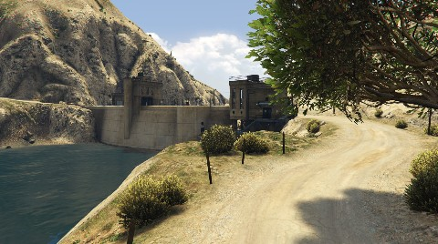

# Dam-Windmill Rally

> **Description:** 
> *Fast paced rally stage set around the dam and the windmill farm.*

> **Length:** *8.1 km*
 
> **Road Composition:**
> *95% Dirt*
> *5% Asphalt*
---
> **Preview:**
> 
> 

---

> **Pace Notes:**

		Right	5
		Left 	4
		Right	6	CAUTION Jump
	into	Left 	4
		80
		Right	4
	into	Left	4
		Right	2
		Left	5
	into	Right	4	
		Line
		Right	6	Long; Jump Maybe
	into	Left	4	CAUTION; Opens
		Left	3	Down
	into	Right	3
		50		Over Bridge
		Left 	4
		Right 	2	CAUTION
		Left	6	Don't Cut
		Left	3
		Right	6
		Left	3
		Right	6
	into	Left	5	Over Bumps
		Right	4	Tightens and Opens
		Left	4
	into	Right	3	CAUTION
	into	Left	2	Over Bump; Onto Dam; 
		Right	6	Tight
		Left	2	At Junction
	into	Right 	5
	into	Left	2
		Right	3	Over Crest
		Line
		Left	2
	into	Right	1
		Left	2	Over Crest
	into	Right	1	Keep Left; Rocks Outside
		Left	5
		Right	6
	into	Left	5	Cut
		Right	6
	into	Left	5
		Left	5
		Right	4
		Left	5
		Right	5
		Left	6	Tightens
	into	Left	4
		Right	4
		Left	6
		Right	5	Down
		Left	4	Down; Keep Left
		Right	4
		Left	4	Keep Right; Jump Maybe
		Asphalt
		100		Keep Left
		Square Right
		Dirt
		50		CAUTION; Jump
		Left	2	Onto Dirt Road
		150
		Hairpin Left
		150
		Acute Right
	into	Right	3
		150
		Right	1
	into	Hairpin Left
		80
		Right	1	Opens
	into	Right	3
		Right	6
		Left	6
		Left	4	Up; Deceptive
		Left	3
		Left	4
	into	Right	2
	into	Left	2
	into	Right	1	Over Crest
		Left	4
		Right	3	Over Crest
		Left	2	Long
		Left	2	CAUTION Braking
		Hairpin Right
		Left	6	Line
	into	Right	6
		Right	3	
		Left	6
	into	Right	3	CAUTION
		Right	6
	into	Left	6
		Hairpin Left
		Right	6
		Left	4	Don't Cut
		Hairpin	Right
		Right	5	Down
		150
		Right	6
	into	Left	5	Over Bump
		FINISH
