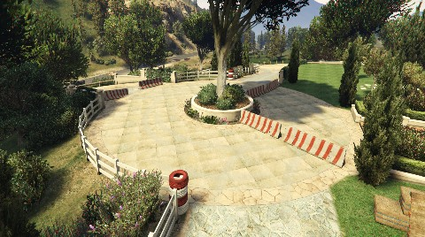

# La fuente Blanca Rally
> **Length:** *4.1 km*
 
> **Road Composition:**
*80% Dirt*
*13% Rough Dirt*
*5% Non-road section*
*2% Asphalt*
---
> **Preview:**

---
> **Pace Notes:** 

		Right 	3	Long
	into	Left 	5	Bumps
		Left 	4
	into	Right 	3
		Right 	2
		Right 	6
	into	Left 	5	Keep left over crest
		Right 	2
	into	Left 	6
		Right 	6
		Square Right
		Left 	3	Up
		Right	1	Up
	into	Left 	1	Up
		Right 	6	Line CAUTION
		Right 	2	Opens; Keep Right
		Left	1
		Acute Right
		Right 	4
	into 	Square Left
		Right 	6
	into 	Left 	5
		Right 	3
		80		CAUTION Keep Left
		Right 	3	Off-Road
		Left	6	Long Through Gates; Onto Bridge
		Square Right
		Square Right	CAUTION Braking
		Square Left
		Right 	2
		Roundabout	Left Entry; Take 2nd exit
		Square left
		Right	2
		300		Through Gates; DOUBLE CAUTION Bumps
		Left 	6	Bumps
		Left 	4	Onto Asphalt Road
		Square Right	Onto Dirt Road; CAUTION Braking
		Hairpin Right
	into	Hairpin Left
		Left 	2	Don't cut
		Right	6 	Down
		Left 	2
	into 	Right	5 	Line
		Left	6	Cross the Highway
		Right	5	Tightens
	into	Right	2	Down
		Left 	4	Cut
		50		Line Down
	into	FINISH